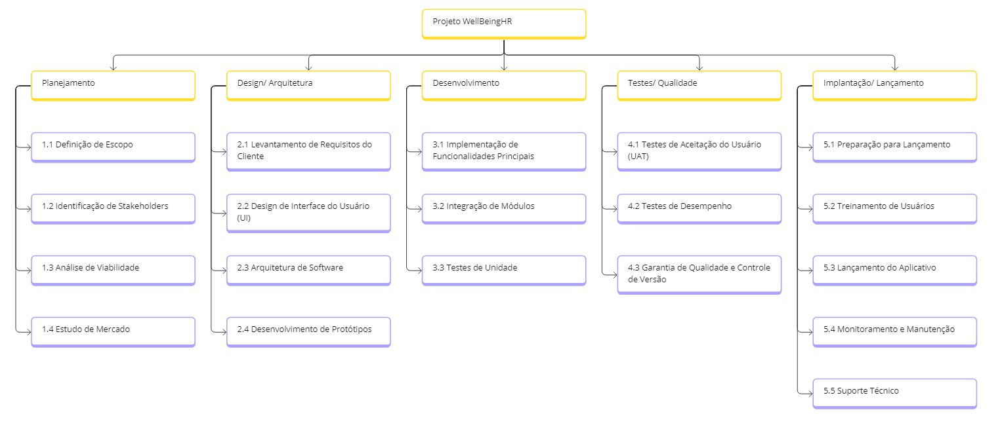
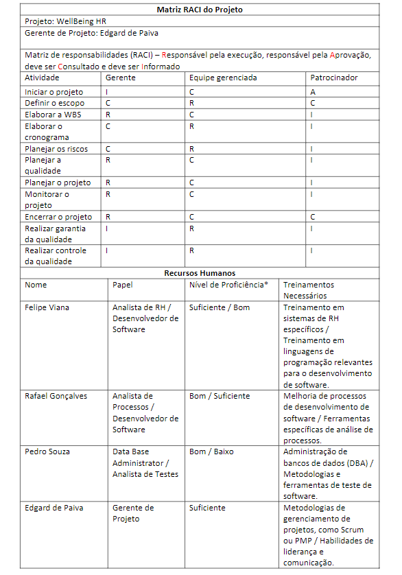
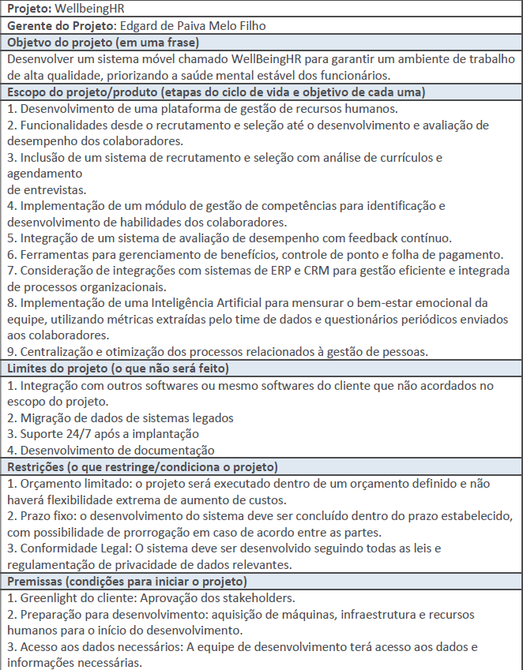
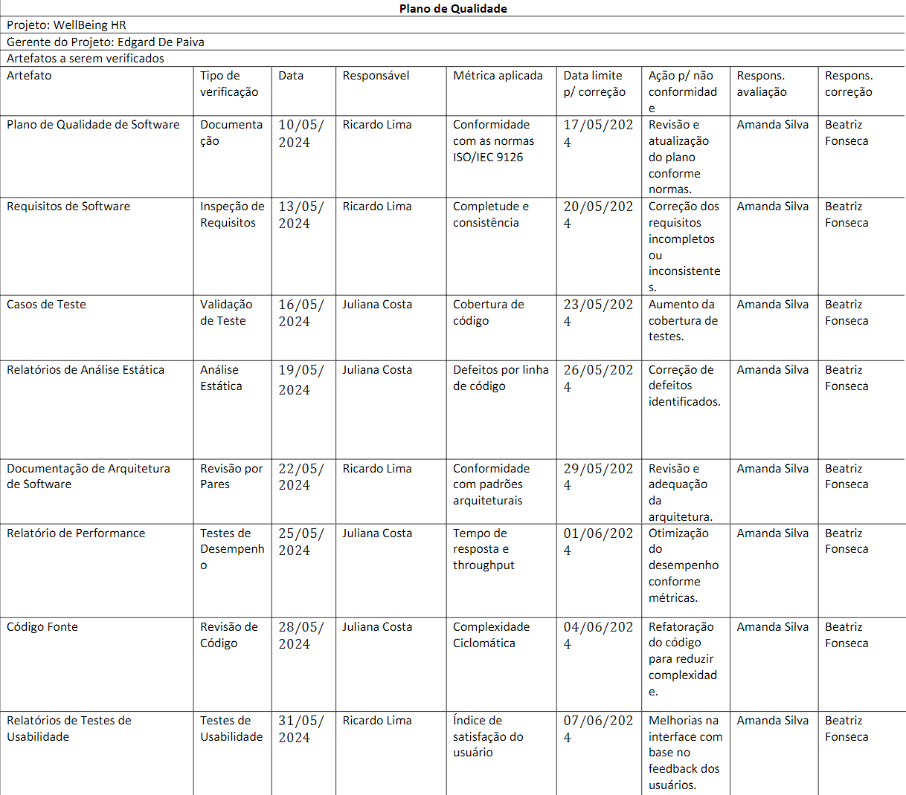
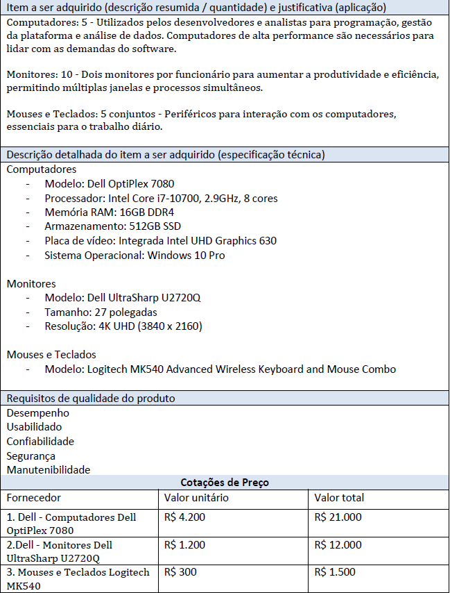

# Planejamento

> A fase de planejamento na gerência de projetos é um momento onde os detalhes do projeto são minuciosamente definidos para garantir uma execução bem-sucedida. 
> Durante essa etapa, os gerentes de projeto e suas equipes elaboram um plano abrangente que aborda aspectos como cronograma, orçamento, recursos necessários, riscos identificados e métodos de controle. 
> O objetivo é criar uma estrutura que guiará as atividades ao longo do projeto, garantindo que metas sejam alcançadas de maneira eficiente. 
> O plano de projeto não apenas define as tarefas específicas e suas interdependências, mas também estabelece critérios de sucesso e indicadores de desempenho. 
> A qualidade do planejamento influencia diretamente a capacidade da equipe em cumprir prazos, alocar recursos eficientemente e lidar com desafios que possam surgir durante a execução.

# Estrutura do Documento

- [Fase de Planejamento](#planejamento)
- [Estrutura Analítica do Projeto](#estrutura-analítica-do-projeto)
- [Matriz de Responsabilidades](#matriz-de-responsabilidades)
- [Escopo do Projeto](#escopo-do-projeto)
- [Cronograma do Projeto](#cronograma-do-projeto)
- [Orçamento do Projeto](#orçamento-do-projeto)
- [Planos de Gerenciamento](#planos-de-gerenciamento)
  - [Plano de Comunicação](#plano-de-comunicação)
  - [Plano de Qualidade](#plano-de-qualidade)
  - [Plano de Riscos](#plano-de-riscos)
  - [Plano de Aquisição](#plano-de-aquisição)
  - [Plano de Gestão de RH](#plano-de-gestão-de-rh)
- [Documentos](#documentos)
  - [Aquisição de Produtos](#aquisição-de-produtos)
  - [Checklist de Qualidade](#checklist-de-qualidade)
  - [Escopo, Cronograma e Orçamento](#escopo-cronograma-e-orçamento)
  - [Estrutura Analítica do Projeto (EAP)](#estrutura-analítica-do-projeto-eap)
  - [Matriz de Responsabilidades (RACI)](#matriz-de-responsabilidades-raci)
  - [Plano de Gerência de Comunicação](#plano-de-gerenciamento-de-comunicação)
  - [Plano de Gerenciamento de Riscos](#plano-de-gerenciamento-de-riscos)

# Estrutura Analítica do Projeto

> A Estrutura Analítica do Projeto (EAP) proporciona uma representação hierárquica atividades que compõem um projeto. 
> Organizando o escopo do projeto em componentes gerenciáveis e compreensíveis, a EAP facilita a decomposição do trabalho em partes menores, tornando mais fácil o planejamento, a atribuição de responsabilidades e o monitoramento do progresso. 
> Cada elemento na estrutura representa uma parcela específica do trabalho a ser realizado, proporcionando clareza sobre as inter-relações entre as diferentes partes do projeto. 
> A EAP serve como a base para a criação do cronograma do projeto, a alocação de recursos e a identificação de dependências. 
> Essa abordagem estruturada contribui significativamente para o sucesso do projeto, garantindo uma compreensão abrangente do escopo e uma base sólida para a gestão eficaz do trabalho ao longo do ciclo de vida do projeto.

> **Exemplo de EAP:**
> 

> Softwares recomendados: 
> * [WBS Schedule Pro (Demo)](https://www.criticaltools.com/)
> * [Draw.io](https://app.diagrams.net/)
> * [ProjectLibre](https://www.projectlibre.com/)

# Matriz de Responsabilidades

> A Matriz de Responsabilidades é uma ferramenta para definir e indicar as responsabilidades de cada membro da equipe em relação às atividades do projeto. 
> Também conhecida como RACI (Responsável, Aprovador, Consultado e Informado), essa matriz atribui papéis específicos a cada envolvido, indicando quem é responsável pela execução de uma tarefa, quem deve aprovar, quem precisa ser consultado e quem deve ser mantido informado. 
> Ao criar uma visão visual e estruturada das responsabilidades, a matriz RACI minimiza ambiguidades e conflitos de papel.
> Essa ferramenta não apenas esclarece as expectativas em termos de contribuições individuais, mas também contribui para um ambiente de trabalho mais organizado e transparente, resultando em uma gestão de projeto mais eficaz e bem-sucedida.

> Informações Adicionais:
> * **R**esponsible -> Executor (pessoa(s) que executará(ão)/desenvolverá(ão) a atividade)
> * **A**ccountable -> Responsável (pessoa responsável por aprovar a atividade)
> * **C**onsulted   -> Consultado (especialista consultado sobre a atividade ou parte dela)
> * **I**nformed    -> Informado (pessoas interessadas no projeto que devem ser informadas sobre a execução).
> 
> 

# Escopo do Projeto

>Escopo do projeto/produto (etapas do ciclo de vida e objetivo de cada uma)
>1. Desenvolvimento de uma plataforma de gestão de recursos humanos.
>2. Funcionalidades desde o recrutamento e seleção até o desenvolvimento e avaliação de desempenho dos colaboradores.
>3. Inclusão de um sistema de recrutamento e seleção com análise de currículos e agendamento de entrevistas.
>4. Implementação de um módulo de gestão de competências para identificação e desenvolvimento de habilidades dos colaboradores.
>5. Integração de um sistema de avaliação de desempenho com feedback contínuo.
>6. Ferramentas para gerenciamento de benefícios, controle de ponto e folha de pagamento.
>7. Consideração de integrações com sistemas de ERP e CRM para gestão eficiente e integrada de processos organizacionais.
>8. Implementação de uma Inteligência Artificial para mensurar o bem-estar emocional da equipe, utilizando métricas extraídas pelo time de dados e questionários periódicos enviados aos colaboradores.
>9. Centralização e otimização dos processos relacionados à gestão de pessoas.
>
>Limites do projeto (o que não será feito)
>1. Integração com outros softwares ou mesmo softwares do cliente que não acordados no escopo do projeto.
>2. Migração de dados de sistemas legados
>3. Suporte 24/7 após a implantação
>4. Desenvolvimento de documentação 
>
>Restrições (o que restringe/condiciona o projeto)
>1. Orçamento limitado: o projeto será executado dentro de um orçamento definido e não haverá flexibilidade extrema de aumento de custos.
>2. Prazo fixo: o desenvolvimento do sistema deve ser concluído dentro do prazo estabelecido, com possibilidade de prorrogação em caso de acordo entre as partes.
>3. Conformidade Legal: O sistema deve ser desenvolvido seguindo todas as leis e regulamentação de privacidade de dados relevantes.
>
>Premissas (condições para iniciar o projeto)
1. Greenlight do cliente: Aprovação dos stakeholders.
2. Preparação para desenvolvimento: aquisição de máquinas, infraestrutura e recursos humanos para o início do desenvolvimento.
3. Acesso aos dados necessários: A equipe de desenvolvimento terá acesso aos dados e informações necessárias.

> 

# Cronograma do Projeto

> O cronograma do projeto fornece uma representação temporal detalhada de todas as atividades, marcos e eventos ao longo do ciclo de vida do projeto. 
> Elaborado durante o planejamento, o cronograma é uma ferramenta que oferece uma visão das interdependências entre as tarefas, alocando recursos e definindo prazos para as entregas.
> Utilizando técnicas como a análise de rede (PERT/CPM) e estimativas de duração, o cronograma ajuda na identificação de caminhos críticos, permitindo aos gestores de projeto otimizar recursos, antecipar potenciais atrasos e tomar decisões. 
> Além disso, o cronograma serve como um guia para monitorar o progresso, comunicar efetivamente com a equipe e as partes interessadas, e ajustar estratégias para garantir a conclusão bem-sucedida do projeto dentro dos prazos estabelecidos.
>
>Cronograma do projeto em formato pod:
>

# Orçamento do Projeto

> O orçamento do projeto envolve a estimativa e alocação de recursos financeiros necessários para a execução bem-sucedida do projeto, abrangendo custos diretos e indiretos, despesas operacionais, investimentos em equipamentos, pessoal, entre outros. 
> O desenvolvimento do orçamento deve considerar variáveis como riscos, imprevistos e mudanças no escopo. 
> Uma vez estabelecido, o orçamento serve como guia para a utilização eficiente dos recursos financeiros ao longo do projeto. 
> A gestão do orçamento não apenas ajuda a controlar os custos, mas também fornece transparência e prestação de contas, permitindo que gestores tomem decisões informadas e evitem surpresas financeiras ao longo do ciclo de vida do projeto. 
> Assim, o orçamento contribui para o sucesso do projeto, garantindo a viabilidade econômica e a entrega dentro das expectativas financeiras estabelecidas.
>
>

# Planos de Gerenciamento

> Os planos de gerenciamento do projetos consolidam as diretrizes e estratégias para a execução bem-sucedida de um empreendimento. 
> Ele abrange diversos aspectos, como escopo, cronograma, custos, riscos, qualidade, recursos humanos, comunicação e aquisições, proporcionando uma visão abrangente e integrada do projeto. 
> Este plano funciona como um guia mestre que orienta a equipe de projeto e as partes interessadas ao longo do ciclo de vida do projeto, estabelecendo expectativas, responsabilidades e processos. 
> Além disso, serve como um instrumento de comunicação, alinhando as expectativas entre os membros da equipe e as partes interessadas, mitigando riscos e fornecendo uma estrutura sólida para a tomada de decisões. 

## Plano de Comunicação

> O Plano de Comunicação estabelece estratégias e diretrizes para facilitar a troca de informações entre os membros da equipe e as partes interessadas. 
> Este plano abrange aspectos como os meios de comunicação, a frequência das atualizações, os canais de distribuição de informações e os responsáveis pela comunicação. 
> Uma comunicação eficiente não apenas previne mal-entendidos e conflitos, mas também fortalece o engajamento da equipe e o apoio das partes interessadas. 

>

## Plano de Qualidade

......  COLOQUE AQUI O SEU TEXTO ......

> O Plano de Qualidade auxilia a garantir que as entregas do projeto atendam aos padrões de qualidade definidos. 
> Este plano abrange atividades como definição de padrões, procedimentos de garantia de qualidade, critérios de aceitação e processos de monitoramento e controle da qualidade ao longo do ciclo de vida do projeto. 
> Ao identificar metas de qualidade, responsabilidades da equipe, e métricas de avaliação, o Plano de Qualidade busca assegurar que o projeto atinja ou exceda as expectativas dos stakeholders em termos de desempenho e conformidade. 
> A adoção de políticas de qualidade auxilia a mitigar riscos, promove a confiança nas entregas do projeto e, por fim, aumenta a probabilidade de sucesso do empreendimento. 

>

## Plano de Riscos

> O plano de riscos busca antecipar, avaliar e mitigar os desafios potenciais que podem surgir ao longo do projeto. 
> Este documento estratégico oferece uma visão global dos riscos, categorizando-os e delineando estratégias para lidar com cada uma das possíveis adversidades. 
> Inicialmente, é realizada a identificação detalhada dos riscos, abrangendo desde ameaças imprevistas até oportunidades que podem ser exploradas. 
> Uma vez catalogados, os riscos são avaliados quanto à sua probabilidade de ocorrência e impacto, permitindo a priorização e foco em áreas críticas.
>
> O plano de riscos não apenas destaca os perigos em potencial, mas também estabelece respostas e estratégias de contingência. 
> Isso inclui a definição de ações preventivas para mitigar riscos antes que se materializem, bem como estratégias de mitigação para minimizar seu impacto se ocorrerem. 
> Além disso, a identificação de pontos de monitoramento contínuo ao longo do projeto permite uma resposta ágil às mudanças nas condições do ambiente.

>

## Plano de Aquisição

> O Plano de Aquisições define o processo relacionado à aquisição de bens e serviços necessários para a execução do projeto. 
> Este plano abrange a identificação de necessidades, a seleção de fornecedores, a elaboração de contratos, e a gestão do relacionamento com os fornecedores durante do ciclo de vida do projeto. 
> O Plano de Aquisições visa garantir a aquisição eficiente e eficaz dos recursos necessários, minimizando riscos e custos. 
> Além disso, ele proporciona transparência nas relações com fornecedores, promovendo a conformidade com os prazos estabelecidos e padrões de qualidade. 

>

## Plano de Gestão de RH

......  *(OPCIONAL)* COLOQUE AQUI O SEU TEXTO ......

> O Plano de Gestão de Recursos Humanos (RH) estabelece estratégias para o gerenciamento eficaz da equipe.
> Este plano abrange aspectos como a identificação das necessidades de recursos humanos, a alocação de pessoal, o desenvolvimento de competências, a definição de papéis e responsabilidades, e estratégias de motivação e retenção da equipe. 
> Este plano visa otimizar o desempenho da equipe, promovendo um ambiente de trabalho colaborativo, em que as habilidades certas estejam disponíveis no momento adequado. 
> Além disso, aborda a comunicação interna, resolução de conflitos e planos de desenvolvimento profissional. 

# Documentos

> Esta seção deve ser utilizada para armazenamento e listagem dos documentos e artefatos produzidos durante as aulas.
> Atualize os documentos nos respectivos links.

## Aquisição de Produtos

- [Declaração de Escopo](pdfs/DefinicaoDeEscopo.pdf)

## Checklist de Qualidade

- [Checklist de Qualidade](pdfs/Plano%20de%20Qualidade.pdf)

## Escopo, Cronograma e Orçamento

- [Cronograma e Orçamento do Projeto](artefatos/projetoGRUPO8_tarefa8.pod)

## Estrutura Analítica do Projeto (EAP)

- [Estrutura Analítica do Projeto](pdfs/EAP.pdf)

## Matriz de Responsabilidades (RACI)

- [Declaração de Escopo](pdfs/Matriz%20RACI.pdf)

## Plano de Gerenciamento de Comunicação

- [Plano de Gerenciamento de Comunicação](pdfs/Plano%20de%20Comunicacao.pdf)

## Plano de Gerenciamento de Riscos

- [Plano de Gerenciamento de Riscos](pdfs/Lista%20de%20Riscos.pdf)